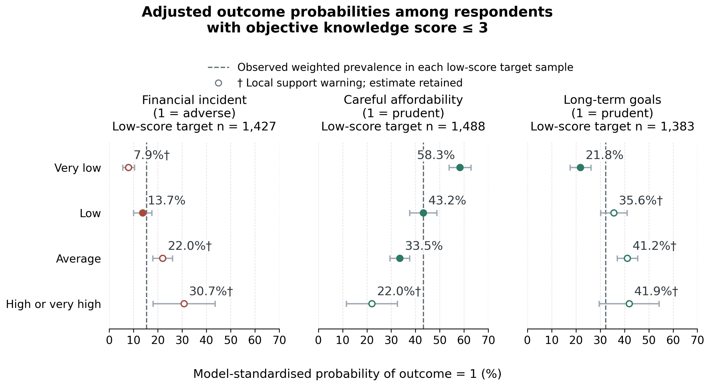
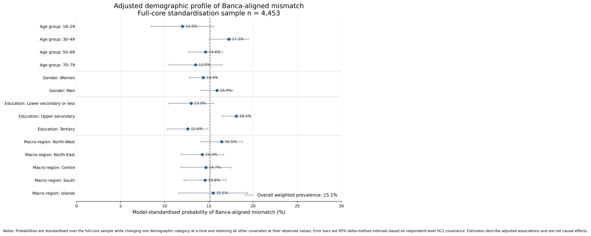

# The Confidence Trap

### Financial knowledge, confidence and behaviour among Italian adults

[](https://www.python.org/)
[](https://pandas.pydata.org/)
[](https://www.statsmodels.org/)
[](https://colab.research.google.com/github/hervemottaran/confidence-trap-financial-literacy/blob/main/notebooks/confidence_trap.ipynb)

**Financial education has to reach people who may not recognise what they do not know.** This project examines the gap between tested financial knowledge and self-assessed competence, and asks whether that gap is associated with financial incidents and everyday financial behaviour.

Using the **Bank of Italy's IACOFI 2023 survey of 4,862 adults**, the analysis combines a reproducible data audit, weighted descriptive statistics, logistic regression, adjusted probabilities and focused robustness checks. The aim is to inform financial-education outreach and content for stakeholders such as the Bank of Italy and Italy's Committee for Financial Education.

[Read the report](report/project_report.pdf) · [Explore the notebook](notebooks/confidence_trap.ipynb) · [Get the source data](data/README.md)

Group project for **Data Science Lab**, University of Milano-Bicocca, 2025/2026. **Final grade: 30/30.**

## Main findings

### A gap that knowledge scores alone do not describe

The primary mismatch combines an **objective knowledge score of 3 or below out of 7** with a **self-rating of average or higher**. The threshold follows the Bank of Italy comparison used in the report; broader and stricter definitions are examined separately.

- **15.1%** of respondents with valid joint knowledge and self-rating information fall into this group, after applying survey weights. The unweighted count is **712 out of 4,453**.
- Within the low-knowledge group, **38.7%** rate their knowledge as average or higher. This is a different denominator: **712 out of 1,607** unweighted respondents.

### Higher confidence accompanies different financial behaviours

Among respondents with low objective knowledge, adjusted probabilities vary with self-rating even after accounting for measured knowledge, age, gender, education and macro-region.

The table shows the pre-specified **Average minus Low self-rating** contrast in the primary models. Differences are in percentage points, with 95% confidence intervals.

| Outcome | Adjusted difference | 95% confidence interval | Reading of the primary result |
|---|---:|---:|---|
| Reported at least one financial incident | **+8.2 pp** | +2.7 to +13.7 | Higher incident probability; limited local data support |
| Carefully considers affordability before a purchase | **−9.7 pp** | −16.6 to −2.8 | Lower probability of careful purchasing |
| Sets and pursues long-term financial goals | **+5.6 pp** | −1.3 to +12.5 | Positive but inconclusive contrast; limited local data support |



Models are fitted on each outcome's full available sample. Predictions are then standardised over that outcome's low-knowledge subgroup, holding objective knowledge and demographic covariates at their observed values and averaging with survey weights. The target samples contain 1,427, 1,488 and 1,383 respondents respectively. Open markers and daggers flag limited local data support.

### Robustness changes the strength of the story

The financial-incident contrast remains positive and its interval excludes zero in all five examined specifications, although support warnings persist. The affordability contrast stays negative, but its income-adjusted interval includes zero. The long-term-goals contrast becomes clearer in the income-complete samples, with much of the change already present before adding income to the model.

Upper-secondary education remains the highest-probability education category in the adjusted mismatch profiles. Age rankings are less stable: the leading category changes from ages 30–49 in the primary model to 18–29 after income adjustment.



## From findings to stakeholder decisions

The results suggest three practical priorities for financial-education providers:

1. **Pair knowledge checks with self-assessment.** Identify people whose educational needs may not be apparent from their own assessment.
2. **Connect learning to concrete decisions.** Use financial-risk recognition and affordability checks as entry points for educational content.
3. **Evaluate the outreach approach.** Pilot an invitation with personalised knowledge feedback against a standard invitation, measuring participation, completion and subsequent decision-making.

The survey motivates these proposals; their effectiveness would need to be established by the pilot. The models estimate adjusted associations in cross-sectional data and do not establish that confidence causes financial outcomes.

## Analytical workflow

| Notebook module | Purpose |
|---|---|
| 1. Analysis Protocol and Raw-Data Audit | Register the source file, validate its checksum and structure, map missing-response codes and define analytical variables |
| 2. Data Cleaning and Variable Construction | Apply knowledge-scoring rules, construct outcomes and covariates, and validate analytical checkpoints |
| 3. Descriptive Analysis of the Confidence Trap | Describe knowledge, confidence, mismatch profiles, demographics and financial outcomes using survey weights |
| 4. Adjusted Profiling, Financial Outcomes, and Robustness | Estimate weighted logistic models, calculate adjusted probabilities and contrasts, and check sensitivity to samples and additional covariates |

The outcome specifications include an interaction between objective knowledge and self-rating. Inference uses respondent-level HC1 robust covariance estimates and delta-method confidence intervals for adjusted probabilities and contrasts.

There are 26 registered model specifications, including paired sample anchors and sensitivity models. Four models have priority in the report: one mismatch-profiling model and three primary financial-outcome models. Shopping around for financial products is a secondary outcome because it applies to a smaller, restricted population.

## Repository contents

| Location | Contents |
|---|---|
| [`notebooks/confidence_trap.ipynb`](notebooks/confidence_trap.ipynb) | Complete analytical workflow, with saved tables and figures |
| [`report/project_report.pdf`](report/project_report.pdf) | Final report, with personal contact details removed from its first page |
| [`assets/`](assets/) | Selected figures generated by the notebook |
| [`data/README.md`](data/README.md) | Official source, expected dataset and download instructions |
| [`requirements.txt`](requirements.txt) | Analytical dependency versions and Jupyter |
| [`docs/reproducibility.md`](docs/reproducibility.md) | Execution instructions, validation notes and publication changes |

Raw microdata, respondent-level processed files and generated working directories are excluded. Running the notebook creates the analytical tables, figures and checkpoints locally or in your own Google Drive.

## Running the notebook

### Google Colab

1. Download and extract the **2023 English Stata dataset** following [`data/README.md`](data/README.md).
2. In your own Google Drive, create `The_Confidence_Trap/data/raw/` and place `Database_ENG.dta` inside it.
3. Open the notebook using the Colab badge above. Save a copy in your Drive if you want to retain changes.
4. Connect Google Drive when prompted and run the cells in order. The remaining project directories are created automatically.

The notebook reports installed package versions. For exact dependency versions or local execution, use `requirements.txt`; detailed instructions are in [`docs/reproducibility.md`](docs/reproducibility.md).

### Local Jupyter

Use Python 3.12. From the repository root:

```bash
python -m venv .venv
# macOS / Linux:
source .venv/bin/activate
# Windows PowerShell: .venv\Scripts\Activate.ps1
python -m pip install -r requirements.txt
jupyter lab notebooks/confidence_trap.ipynb
```

Place `Database_ENG.dta` in `data/raw/` before running all cells. The notebook detects local execution and skips Google Drive mounting. Saved outputs allow the analysis to be read without downloading the data or running the models.

The portfolio notebook has also been run locally from start to finish: all 71 code cells completed, all 26 models converged and the 43 generated tables matched the validated submission results.

## Limitations

- Cross-sectional data support associations, with possible reverse causality and unmeasured confounding.
- Self-rating is relative to other people; the mismatch indicators are operational definitions rather than direct measurements of an individual's overestimation.
- Some self-rating and outcome combinations have limited local data support, especially at high confidence levels.
- Income non-response changes the available sample, so robustness comparisons separate sample restrictions from additional adjustment.
- The workflow was designed for explanation and stakeholder interpretation. Out-of-sample classification performance was not evaluated.

## Data source

Bank of Italy, **Survey on Financial Literacy and Digital Financial Skills in Italy: Adults (IACOFI), 2023**. The original microdata and questionnaire are available from the [official survey page](https://www.bancaditalia.it/statistiche/tematiche/indagini-famiglie-imprese/alfabetizzazione/index.html?com.dotmarketing.htmlpage.language=1). Full references are included in the report.

This is an independent university project; naming the institutions as stakeholders does not imply their involvement or endorsement.

## Authors and acknowledgements

- **Hervé Mottaran**
- **Nicolò Bachiorri**
- **Davide Francesco Caramia**

Developed collaboratively for the **Data Science Lab** course at the University of Milano-Bicocca (2025/2026).

Claude and ChatGPT supported coding, methodological discussion, translation, editorial revision and LaTeX formatting. Analytical decisions and interpretations were reviewed by the project team. The submitted report also contains an AI-use declaration.
